# PRAGATI Knowledge Graph Report

**Generated**: 2026-04-30
**Total Nodes**: 152
**Total Edges**: 261
**Total Hyperedges**: 4

## 🏗 Architecture Overview
PRAGATI is a Next.js application built for the Maharashtra Agriculture Office. It uses a multi-LLM strategy (Claude + Gemini) to process farmer grievances, classify documents, and detect fraud.

## 🏘 Communities
### API & Logic (13 nodes)
`Analyze Grievance API`, `Applications API`, `Batch Applications API`, `Application Detail API`, `Audit Log API`, `Check Eligibility API`, `Classify Document API`, `Constants API`, `Dashboard Statistics API`, `Distress Score API` ...

### Frontend & UI (6 nodes)
`Root Layout`, `Home Page`, `Clerk Dashboard`, `Login Server Actions`, `Login Page`, `Officer Dashboard`

### Infrastructure & Auth (3 nodes)
`middleware.ts`, `middleware()`, `Next.js Middleware`

### Documentation & Assets (8 nodes)
`Project Handoff`, `Progress Tracker`, `README`, `File Icon (SVG)`, `Globe Icon (SVG)`, `Next.js Logo (SVG)`, `Vercel Logo (SVG)`, `Window Icon (SVG)`

### Utilities & Libs (122 nodes)
`eslint.config.mjs`, `next-env.d.ts`, `next.config.ts`, `postcss.config.mjs`, `layout.tsx`, `RootLayout()`, `page.tsx`, `route.ts`, `POST()`, `route.ts` ...

## 🔄 Critical Flows
- **Officer Command Center Flow**: Connects dashboard_api, applications_api, distress_api, audit_api
- **AI Analysis Pipeline**: Connects analyze_grievance_api, check_eligibility_api, classify_document_api
- **Multi-LLM Strategy**: Connects claude_lib, gemini_lib
- **Project Documentation Set**: Connects handoff_doc, progress_doc, readme_doc

## 📊 Dependency Diagram

```mermaid
graph TD
  eslint_config_mjs -->|imports_from| path
  eslint_config_mjs -->|imports_from| url
  eslint_config_mjs -->|imports_from| eslintrc
  middleware_ts -->|imports_from| ssr
  middleware_ts -->|imports_from| server
  middleware_ts -->|contains| pragati_middleware_middleware
  next_config_ts -->|imports_from| next
  app_layout_tsx -->|imports_from| next
  app_layout_tsx -->|imports_from| google
  app_layout_tsx -->|imports_from| d_pragati_app_globals_css
  app_layout_tsx -->|imports_from| sonner
  app_layout_tsx -->|contains| app_layout_rootlayout
  app_page_tsx -->|imports_from| image
  app_api_analyze_grievance_route_ts -->|imports_from| server
  app_api_analyze_grievance_route_ts -->|imports_from| d_pragati_lib_supabase_server
  app_api_analyze_grievance_route_ts -->|imports_from| d_pragati_lib_gemini
  app_api_analyze_grievance_route_ts -->|imports_from| d_pragati_lib_claude
  app_api_analyze_grievance_route_ts -->|imports_from| d_pragati_lib_constants
  app_api_analyze_grievance_route_ts -->|imports_from| d_pragati_lib_audit
  app_api_analyze_grievance_route_ts -->|imports_from| d_pragati_lib_distress
```

